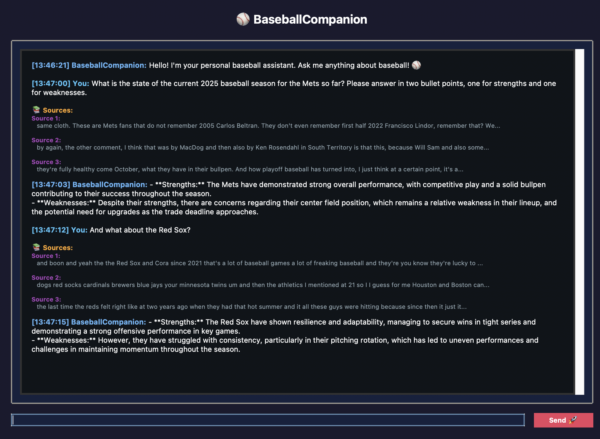

# baseballCompanion

App that allows you to ask natural language questions about the current state of baseball based on recent YouTube analysis videos. It uses Whisper for transcription, SentenceTransformers for embedding, FAISS as a vector database, and llama.cpp for local LLM inference with RAG (Retrieval-Augmented Generation). Currently using Mistral 7B instruct, but flexible to model backends. No keys needed. 




- [baseballCompanion](#baseballcompanion)
  - [Tools](#tools)
  - [📊 Example: Before and After RAG (Retrieval-Augmented Generation)](#-example-before-and-after-rag-retrieval-augmented-generation)
    - [â“ Question](#-question)
    - [🧠 Before RAG (No Context Used)](#-before-rag-no-context-used)
    - [🚀 After RAG (With Retrieved Context)](#-after-rag-with-retrieved-context)
    - [📂 Context Retrieved (Top 3 Sources)](#-context-retrieved-top-3-sources)
  - [🧪 How to Reproduce](#-how-to-reproduce)
    - [Prerequisites](#prerequisites)
  - [Optimizations - ToDo](#optimizations---todo)
      - [Enginge to keep RAG relevant](#enginge-to-keep-rag-relevant)
    - [Disclaimer](#disclaimer)


## Tools

- **faster-whisper** for super fast transcription of videos to audio
- yt-dlp as a download engine for videos
- **llama.cpp** as an inference engine with flexible model backends and can run on apple silicon
  - llama.cpp is somewhat slow, so there is now openAI calling using **gpt-4o-mini**
- **mistral-7b-instruct** as the base model
- **sentence_transformers** as the sentence embedding model
- **LangChain** for RAG, query construction, query refinement, etc..


## 📊 Example: Before and After RAG (Retrieval-Augmented Generation)

This example demonstrates how retrieval improves the factuality and specificity of answers in a sports domain question.

---

### â“ Question

**What is the situation with Juan Soto and the Mets in 2025?**  
(Please answer in bullet points)

---

### 🧠 Before RAG (No Context Used)

**Answer:**

- As of October 2023, Juan Soto is under contract with the San Diego Padres through the 2024 season.  
- There have been speculations regarding his potential trade or free agency, but no definitive moves have been made for him to join the New York Mets by 2025.  
- The Mets have shown interest in acquiring star players, which could include Soto if he becomes available.  
- Soto's performance and the Padres' success in 2024 will likely influence his future, including any potential dealings with the Mets.  
- By 2025, the Mets could be in a position to pursue Soto if his contract situation changes or if he becomes a free agent after the 2024 season.

---

### 🚀 After RAG (With Retrieved Context)

**Answer:**

- Juan Soto is under a massive contract worth $750 million, with an annual salary of $50 million.  
- As of 2025, there are discussions about Soto’s performance and potential struggles, indicating he may not be meeting his own standards.  
- The Mets are performing well in the league, currently holding a record of 29-19, suggesting they are competitive.  
- There is speculation about Soto’s feelings toward his decision to join the Mets, with hints that he may miss the Yankees and the permanence of his contract is sinking in.  
- Media narratives are focusing on Soto’s competitiveness and the pressure he feels to live up to his contract.  
- The situation is being closely observed by fans and journalists, with some expressing dissatisfaction with the coverage and narratives surrounding Soto’s performance.

---

### 📂 Context Retrieved (Top 3 Sources)

<details>
<summary>Source 1</summary>

> Juan Soto knows he's not playing up to his own standards. It's painfully obvious. No one cares more about Soto's struggles than him. He's extremely competitive and under pressure to live up to his massive contract. It's been seven weeks of baseball and fans are already reacting strongly.

</details>

<details>
<summary>Source 2</summary>

> Media coverage of the Mets and Juan Soto has been highly sensationalized. There's frustration among journalists about not getting key quotes. The conversation reflects broader issues with sports journalism and entitlement among reporters.

</details>

<details>
<summary>Source 3</summary>

> Allegedly, there’s a "rat" leaking internal info. Soto seemed happiest when interacting with Aaron Judge and Yankees staff. There's speculation he misses the Yankees and is feeling the permanence of his decision to join the Mets. Despite this, both the Mets and Yankees are performing well in 2025.

</details>

---

## 🧪 How to Reproduce

This uses top-3 retrieval using the script:

```bash
python app.py
```


### Prerequisites

Install the required tools and packages:

```bash
# Install FFmpeg
brew install ffmpeg  # or sudo apt install ffmpeg

# Install yt-dlp
pip install yt-dlp

# Install Whisper
pip install faster-whisper

# Install sentence-transformers and FAISS
pip install sentence-transformers faiss-cpu

# Clone llama.cpp and compile


git clone https://github.com/ggerganov/llama.cpp.git
brew install llama.cpp


# cd llama.cpp
# make LLAMA_METAL=1
mkdir -p models
# Download a quantized GGUF model (example: Mistral 7B)
wget https://huggingface.co/TheBloke/Mistral-7B-Instruct-v0.1-GGUF/resolve/main/mistral-7b-instruct-v0.1.Q4_K_M.gguf -P models/

# test in conversation mode:
llama-cli -m models/mistral-7b-instruct-v0.1.Q4_K_M.gguf -cnv --chat-template chatml
```


## Optimizations - ToDo


* Can we add semantinc chunking? Sentences right now are getting cut arbitrarily.

    - if I can run a model to chunk by topic, and then by lenght, retrieval might be better

* Add metadata into chunks.

    * This makes it so that we can add 'structured data'-like filters onto our unstructured data (podcast transcriptions)

* Add better attribution

    * The RAG -returned context can be shown back to user so they know where it came from.

* Embed other things like 'what questions can this chunk answer'

    * this makes it so that when we run similarity on the question, we can compare the user question to the embeddings of the chunk. But instead of using the embeddings of the chunk itself, you use embeddings of the question that the chunk can answe. 

* Small-to-big retrieval

    * when we embed an entire chunk of 20-30 sentences of content, there might be some fluff around it. We cant embed every sentence though since that could make things slow, or miss context in retrieval. A nice middle ground is to try small-to-big retrieval. 


#### Enginge to keep RAG relevant

* since the whole point of this app is to keep current news in context, we have to programatically add to our vector database and keep feeding it the latest analysis and news. 


### Disclaimer

--> This is an educational tool to showcase how to work with llms and RAG applications, not for commercial use. 

